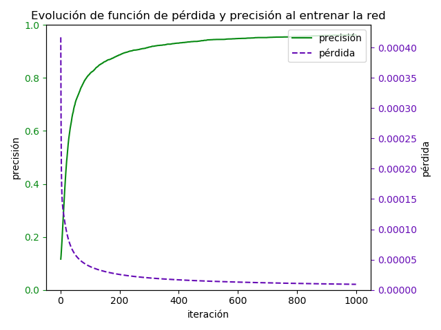
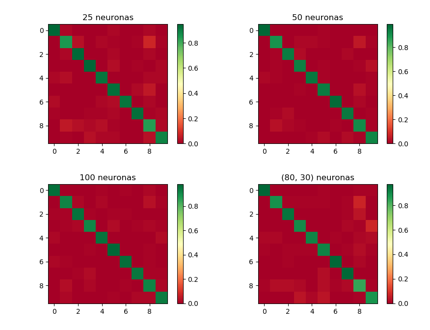
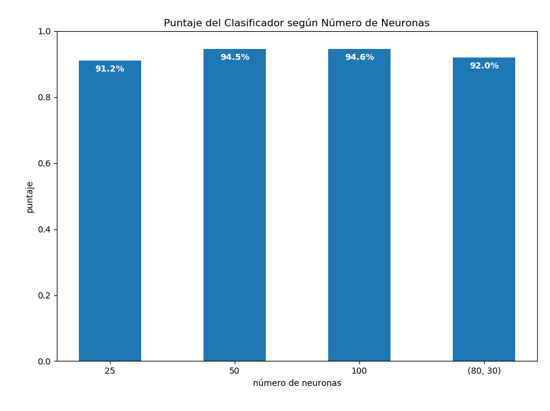

## Tarea 1 - Red Neuronal

### Instalación y Ejecución

La tarea se realizó utilizando python 3.7, es el único requesito previo necesario.

Para instalar las librerías necesarias se debe correr `$ pip install -r requirements.txt`.

Para ejecutar la tarea basta correr el comando `$ python Tarea1.py` desde la carpeta actual (`tarea1/`).

### Dataset

Se utilizaron los datos [*Optical Recognition of Handwritten Digits Data Set*](http://archive.ics.uci.edu/ml/datasets/Optical+Recognition+of+Handwritten+Digits).

El dataset es público y fue tomado del *UC Irvine Machine Learning Repository*.
Este contiene 64 características acerca de imagenes con dígitos manuscritos, con un total de 5620 ejemplos entregados.
En la columna 65 se encuentra la clase de la muestra, el dígito entre 0 y 9 al cuál corresponde.

### Análisis

La tarea fue implementada basándose en el código entregado en u-cursos,
por lo que utiliza operaciones de matrices lo que la hace eficiente al entrenar.
Se programó orientado a objetos para facilitar la comprensión del código principal `Tarea1.py`.
La mayor dificultad encontrada fue permitir tener varias capas ocultas, debido a que se tuvo que realizar muchos
cambios simultáneos en el código de entrenamiento.

### Resultados

A continuación se meustran ejemplos de los resultados obtenidos (utilizando seed=42)

##### Evolución de la red al entrenar

##### Matrices de confusión obtenidas

##### Precisión según neuronas en la capa oculta

En general se aprecian buenos resultados, obteniendo sobre 90% precisión en todas las redes probadas.
Además la implementación permite comparar fácilmente distintas configuraciones, entregando una buena interfaz para el
usuario.

### Ejercicios

La neuronas implementadas en clases se encuentran en la carpeta ejercicios.
