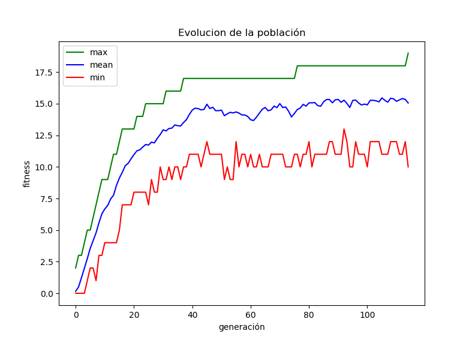
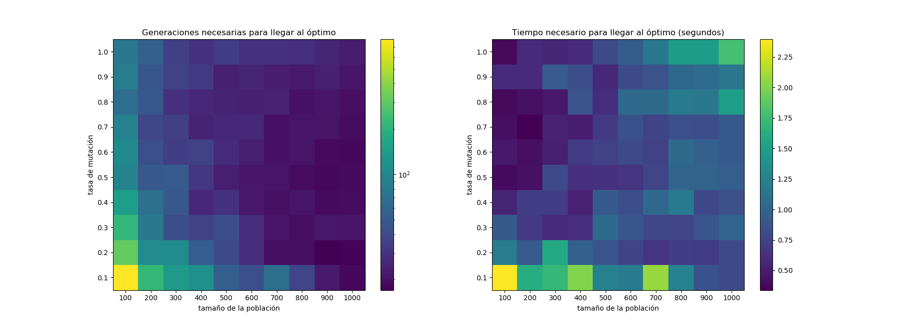

## Tarea 2 - Algoritmos Genéticos

### Instalación y Ejecución

La tarea se realizó utilizando python 3.7, es el único requesito previo necesario.

Para instalar las librerías necesarias se debe correr `$ pip install -r requirements.txt`.

Para ejecutar la tarea basta correr el comando `$ python MazeRobot.py` desde la carpeta actual (`tarea2/`).


### Problema

El problema a resolver será el de encontrar el camino más corto para llegar a la salida de un laberinto. A continuación se muestra un laberinto de ejemplo, el bloque verde representa el inicio, el amarillo la salida y los moraddos los obstáculos.


### Solución

Se consideró como un gen a un paso que toma un individuo en el laberinto. De esta forma, un gen corresponde simplemente a la elección de una dirección (arriba, abajo, izquiera, derecha), y un individuo corresponde a una secuencia de pasos de largo fijo (e.g. `>>>>>vv^v<<vvv<vv>>>>>`). Se tomó un largo lo suficientemente grande para asegurar que se podía llegar a la salida, y al recorrer el laberinto se omiten los pasos que no se pueden ejecutar por chocar con un obstaculo y se termina la secuencia de forma temprana si se llega a la salida.

Se eligió una función de fitness que penaliza la distancia a la salida y la cantidad de pasos válidos realizados. La ponderación es tal que en la mayoría de los casos, un individuo que está más cerca de la salida va a ser mejor que un individuo que tiene un camino más corto.

```python
def fitness(ind):
    dist, length = simulate_path(maze, ind.genes)
    return -(dist * k + length)
```

Finalmente, se tomó como condición de término llegar al camino óptimo (encontrado utilizando *dfs*) o que no hubiera un cambio en el mejor fitness de las últimas 40 generaciones.

### Resultados

A continuación se muestran los resultados obtenidos para el problema de encontrar una frase (`WordFinder.py`) utilizando el ejemplo *"hola como le baila?"*.

La evolución mostrada fue obtenida utilizando 100 individuos y mutación de 0.5 y el mapa de calor muestra número de generaciones necesarias para llegar al óptimo usando distintas configuraciones. Todos los experimentos fueron realizados utilizando elitismo y selección utilizando torneos de tamaño 5.

##### Evolución de la red al entrenar


##### Mapa de calor de desempeño



### Análisis

La implementación del algoritmo fue relativamente sencilla, obteniendo un framework genérico y simple de usar, en el que lo importante al resolver un problema son los genes definidos y la función de fitness, y no el código generado. Esto permite que se puedan abordar poblemas relativamente rápido para ver cómo se comporta el algoritmo genético y qué soluciones encuentra.

Se aprecia en los resultados obtenidos que el algoritmo evoluciona de buena manera, creciendo de forma estable (esto se asegura utilizando elitismo), y manteniendo un buen rango entre el mejor y el peor individuo, asegurando diversidad en la población.

Por otra parte, en el mapa de calor se puede ver que aumentando la tasa de mutación se obtienen resultados más rápido casi siempre, y aumentar el tamaño de la población reduce el número de generaciones necesarias, aunque aumenta el tiempo que toma llegar al óptimo. Esto podría mejorarse utilizando procesamiento paralelo en GPU, en vista de que la generación de cada nuevo individuo es un proceso completamente independiente del resto, de esta forma se podría reducir un poco más el tiempo necesario para llegar al óptimo.

### Ejercicios

Lo ejercicios se encuentran en `WordFinder.py` y `BinaryFinder.py`
